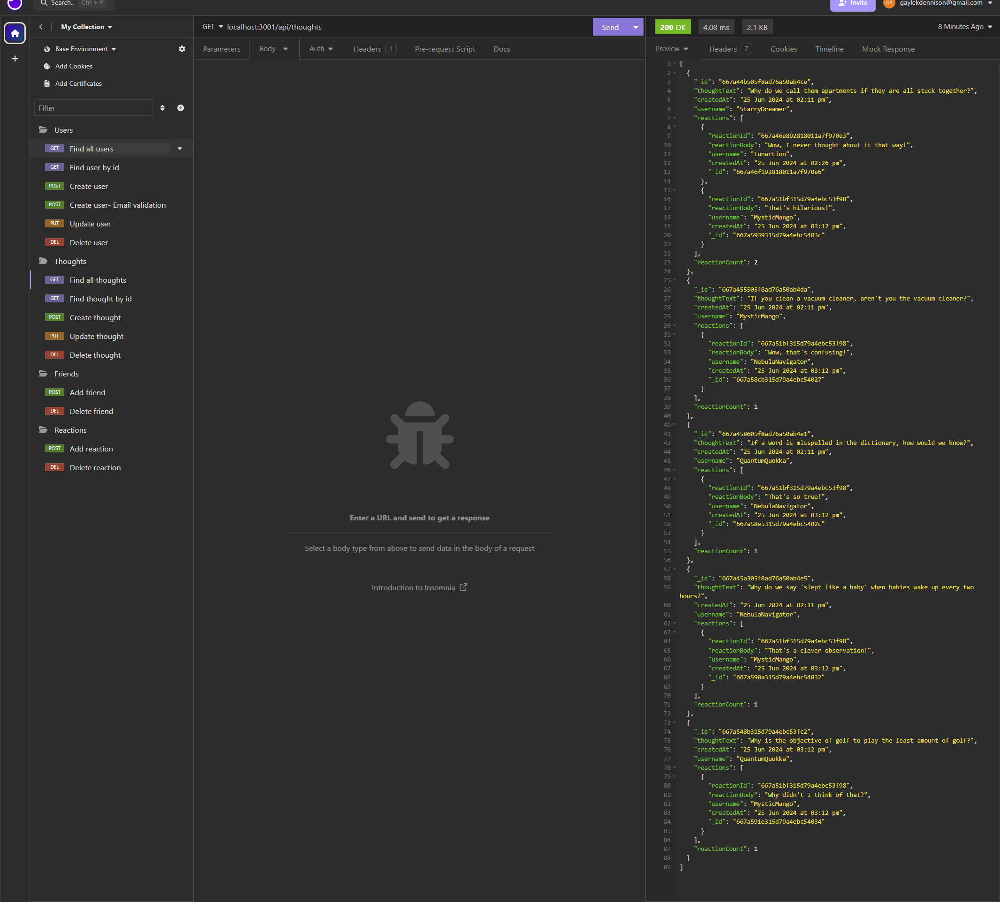
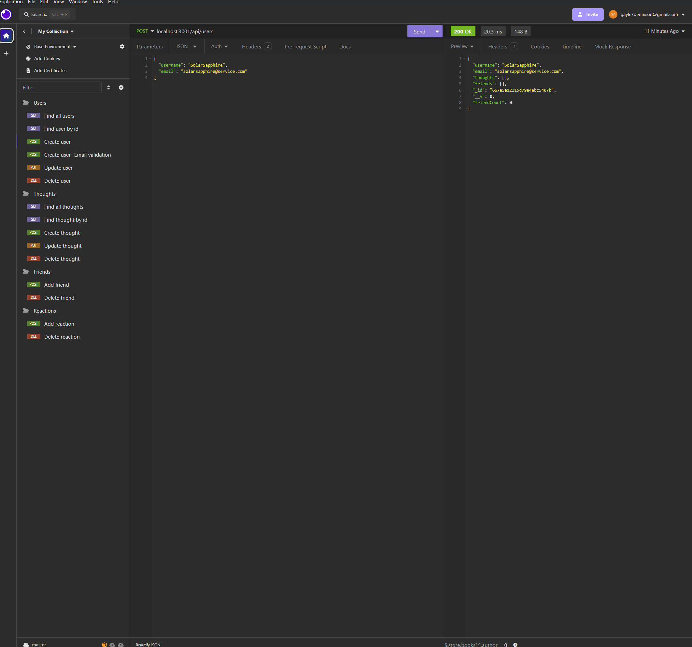
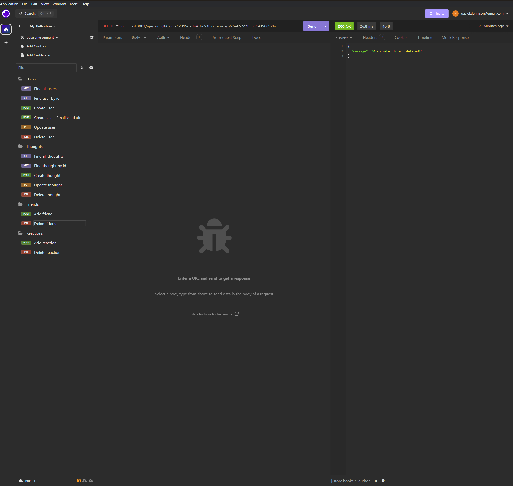
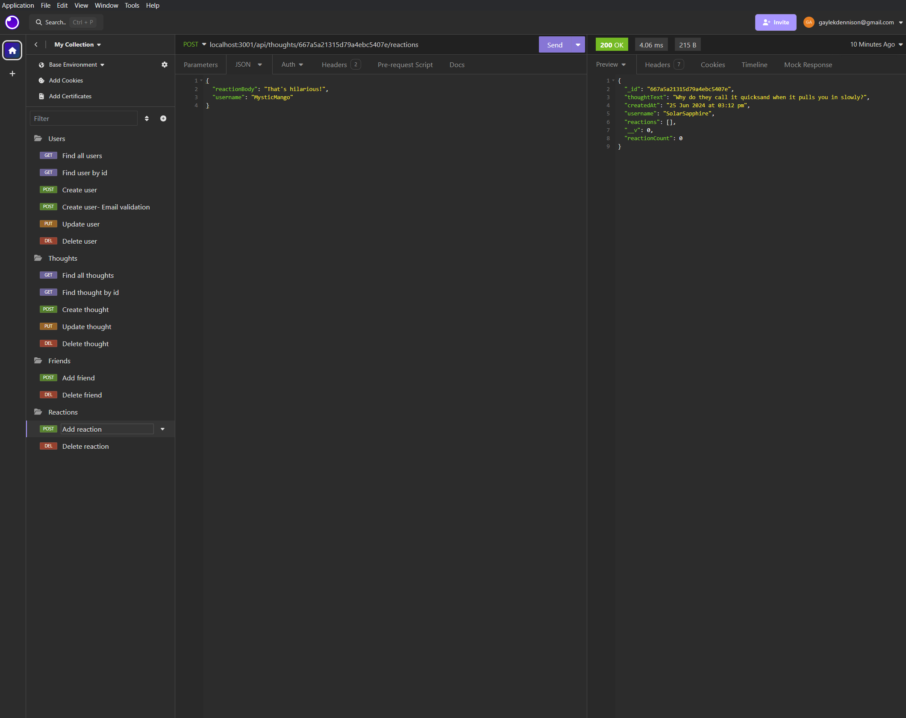

# Social Media API


[](https://opensource.org/licenses/MIT)
  
## DESCRIPTION
This is a social media API that enables users to create thoughts, react to their friends thoughts and curate a list of friends. 


Video walkthrough:(Click on the image to open the video link)
Part 1: GET requests for all users, all thoughts, single user, single thought
[](https://www.loom.com/share/c99c632bb0ef45fc980979e68f6be021?sid=978e84bb-6d16-48cd-ba73-418da0e65283)

Part 2: POST, PUT, DELETE requests for users and thoughts
[](https://www.loom.com/share/757dadc711be459d9bdcaac1b4628e70?sid=29070e4d-050e-4552-bed7-d9b16e0bdcde)

Part 3: POST and DELETE for friends
[](https://www.loom.com/share/503b302e15324f1393b2879b2af15b25?sid=cfc22ec4-3d31-422e-8d71-fc2406c59381)

Part 4: POST and DELETE for reactions
[](https://www.loom.com/share/50a10b83be6f4739a5d7952bd7ae3b4e?sid=4d96e011-5c02-4fb7-a74b-a72c1bfc57fa)


  ## TABLE OF CONTENTS
  
  <ol>
  <li><a href="#description">Description</a></li>
  <li><a href="#installation">Installation</a></li>
  <li><a href="#usage">Usage</a></li>
  <li><a href="#licence">Licence</a> </li>
  <li><a href="#contributions">Contributions</a></li>
  <li><a href="#questions">Questions</a></li>
  </ol>
  
  ## INSTALLATION
To clone from Github, use GitBash   
```git@github.com:gaylemcclure/social-media-api.git```
  
  ## USAGE
  Upon installation of the project, start the app using the terminal with the following commands:   
  ```npm i```
  ```npm init```
  ```npm run dev```
Using insomnia, you are able to complete the following options:

Users:
 - Find all
 - Find one by id
 - Update by id
 - Create new
 - Delete by id

Thoughts:
 - Find all
 - Find one by id
 - Update by id
 - Create new
 - Delete by id

 Friends:
 - Create new
 - Delete by id

  Reactions:
 - Create new
 - Delete by id

 
  
  ## LICENCE
  Distributed under the MIT license. For more information, see <a href=https://opensource.org/licenses/MIT>here</a>
  
  ## CONTRIBUTIONS
  Created by Gayle McClure   
  Uses JavaScript, node.js, MongoDB/Mongoose ORM, express
  
  
  ## QUESTIONS
  Github Username: <a href='https://github.com/gaylemcclure'>Gayle McClure</a>  
  Feel free to email me at gaylekdennison@gmail.com for further questions. 